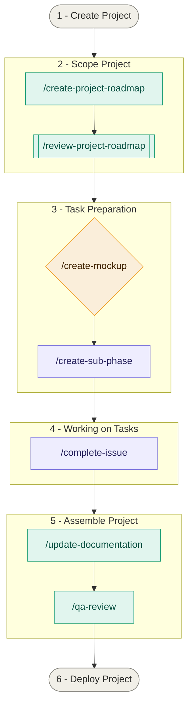

# Project Development Workflow

## Step-By-Step Guide

### Step 1 - Create Project
Initialize project (README.md, .gitignore etc)

### Step 2 - Scope Project
*Custom Claude Code commands available: `/create-roadmap`, `/review-roadmap`*

### Step 3 - Task Preparation
*Custom Claude Code commands available: `/generate-mockups`, `/create-sub-phase`*

When starting a new phase:
- Create project board for new Phase with description from project roadmap.
- Create `phase-X` branch from `master`

For each project sub-phase:
- Create mockups of UI/UX changes (optional - update sub-phase description in roadmap if needed to summarize chosen mockup)
- Create `phase-X-Y` branch from `phase-X` branch
- Create `phase-X-Y` milestone
- Create issues and branches for required work
- For each issue: link to new branch, link to project board, move to "To Do" list (only one sub-phase/milestone in "To Do" at a time)
- Update project roadmap: mark sub-phase as "In progress" and link title to Gitea milestone

### Step 4 - Working on Tasks
*Custom Claude Code command available: `/complete-issue`*

For each issue:
- Checkout pre-made branch (`Y-m-d-short-task-summary`) and rebase on `phase-X-Y` branch
- Complete task
- Open pull request for `Y-m-d-short-task-summary` branch into `phase-X-Y` branch

### Step 5 - Assembling Project
*Custom Claude Code command available: `/update-documentation`, `/qa-review`*

When all issues for sub-phase/milestone have been completed and merged:
- Verify all documentation has been updated for the changes implemented in sub-phase (inside sub-phase branch)
- Mark sub-phase as "Complete" in project roadmap (inside sub-phase branch)
- Open pull request for `phase-X-Y` branch into `phase-X` branch

When all sub-phases have been completed and merged:
- Perform a QA review of `phase-X` branch (inside phase branch)
- Open pull request for `phase-X` branch into `master` branch

Repeat steps 4, 5 and 6 until all phases and sub-phases are completed, utilizing project Kanban board on Gitea to track issues

### Step 6 - Complete Project
When all phases have been completed and merged:
- Verify all documentation is correct
- Run code audit (future skill) to ensure code is high quality and concise
- Package app for production environment and deploy(ment)

---

## Flowchart

*Example flowchart diagram utilizing Claude Code skills*

---

## Resources

- [AI Models Guide](/docs/guides/ai-models.md)
- [Claude Agents Guide](/docs/guides/claude-agents.md)
- [Claude Skills Guide](/docs/guides/claude-skills.md)