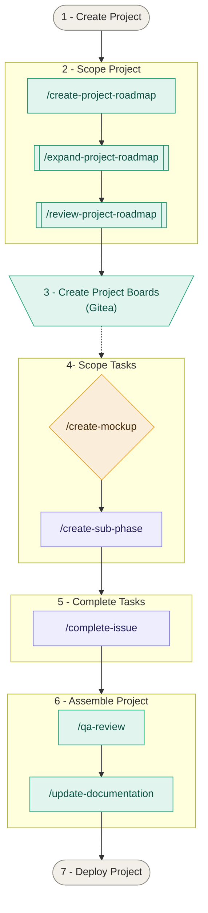

# Project Development Workflow

## Step-By-Step Guide

### Step 1 - Create Project
Initialize project (README.md, .gitignore etc)

### Step 2 - Scope Project
*Custom Claude Code commands available: `/create-roadmap`, `/review-roadmap`*

### Step 3 - Create Gitea Project Boards
Create project boards for each Phase in the Gitea repository.

### Step 4 - Scope Tasks
*Custom Claude Code commands available: `/generate-mockups`, `/create-sub-phase`*

For each project sub-phase:
- Create mockups of UI/UX changes (optional - update sub-phase description in roadmap if needed to summarize chosen mockup)
- Create `phase-X-Y` branch 
- Create `phase-X-Y` milestone
- Create issues and branches for required work
- For each issue: link to new branch, link to project board, move to "To Do" list (only one sub-phase/milestone in "To Do" at a time)
- Update project roadmap: mark sub-phase as "In progress" and link title to Gitea milestone

### Step 5 - Complete Tasks
*Custom Claude Code command available: `/complete-issue`*

For each issue:
- Checkout pre-made branch (`Y-m-d-short-task-summary`) and rebase on `phase-X-Y` branch
- Complete task
- Open pull request for `Y-m-d-short-task-summary` branch into `phase-X-Y` branch

### Step 6 - Assemble Project
*Custom Claude Code command available: `/qa-review`, `/update-documentation`*

When all issues for sub-phase/milestone have been completed and merged:
- Perform a QA review of sub-phase branch (inside sub-phase branch)
- Update documentation with changes implemented in this sub-phase (inside sub-phase branch)
- Mark sub-phase as "Complete" in project roadmap (inside sub-phase branch)
- Open pull request for `phase-X-Y` branch into `master` branch
- Repeat steps 4, 5 and 6 until project is completed, utilizing project Kanban board on Gitea

### Step 7 - Complete Project
When all sub-phases have been completed and merged:
- Update all documentation
- Package app for production environment and deploy(ment)

---

## Flowchart

*Example flowchart diagram utilizing Claude Code skills*

---

## Resources

- [AI Models Guide](/docs/guides/ai-models.md)