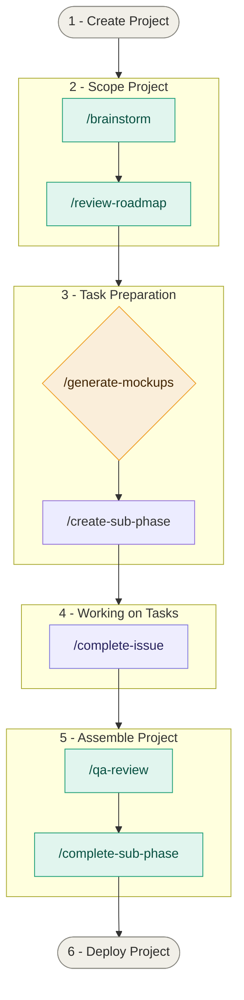

# Project Development Workflow

## Step-By-Step Guide

### Step 1 - Create Project
Initialize project (README.md, .gitignore etc)

### Step 2 - Scope Project
*Commands available: `/brainstorm`, `/review-roadmap`*

- Create or update `ROADMAP.md` from the project's goals (`/brainstorm`).
- Critique the roadmap for gaps, ordering, and over-scoping (`/review-roadmap`) until it is ready to decompose.

### Step 3 - Task Preparation
*Commands available: `/generate-mockups`, `/create-sub-phase`*

When starting a new phase:
- Create the `phase-X` branch from `master`.

For each sub-phase:
- Create mockups of UI/UX changes (optional — update the sub-phase description in the roadmap if needed to summarize the chosen mockup).
- Create the `phase-X-Y` branch from the `phase-X` branch.
- Create the `Phase X.Y` milestone and the issues (2–5) for the sub-phase, each with its plan in the issue body.
- Update the roadmap: mark the sub-phase as in progress and link its title to the Gitea milestone.

### Step 4 - Working on Tasks
*Command available: `/complete-issue`*

For each issue:
- Create and check out the issue branch (`YYYY-MM-DD-short-task-summary`) off the `phase-X-Y` branch.
- Complete the task (implement → scoped review → fix loop → commit).
- Open a pull request for the issue branch into the `phase-X-Y` branch.

### Step 5 - Assembling Project
*Commands available: `/qa-review`, `/complete-sub-phase`*

When all issues for a sub-phase/milestone have been completed and merged:
- Run the full QA review of the sub-phase (`/qa-review`); each Critical finding becomes a `Bug` issue, fixed via `/complete-issue`, then re-run until clean.
- Complete the sub-phase (`/complete-sub-phase`): run the milestone gate, verify all documentation is updated (tick the checkbox and add the milestone link in `ROADMAP.md`), and open the PR for `phase-X-Y` into `phase-X`.

When all sub-phases for a phase have been completed and merged, the phase is completed manually:
- Perform the QA review of `phase-X` (`/qa-review`).
- Open the PR for `phase-X` into `master` manually.

Repeat steps 4 and 5 until all phases and sub-phases are completed, tracking issues via the Gitea milestone.

### Step 6 - Complete Project
When all phases have been completed and merged:
- Verify all documentation is correct.
- Package the app for the production environment and deploy.

---

## Flowchart

*Example flowchart diagram of the workflow.*

```mermaid
flowchart TD
    Start([1 - Create Project])
    End([6 - Deploy Project])

    subgraph SCOPE_PROJECT["2 - Scope Project"]
        S1["/brainstorm"]
        S2["/review-roadmap"]
    end

    subgraph SCOPE_TASKS["3 - Task Preparation"]
        C1{"/generate-mockups"}
        TC1["/create-sub-phase"]
    end

    subgraph DEVELOPMENT["4 - Working on Tasks"]
        D1["/complete-issue"]
    end

    subgraph ASSEMBLE["5 - Assemble Project"]
        QA["/qa-review"]
        CS["/complete-sub-phase"]
    end

    Start --> SCOPE_PROJECT
    S1 --> S2
    S2 --> SCOPE_TASKS
    C1 --> TC1
    TC1 --> DEVELOPMENT
    D1 --> ASSEMBLE
    QA --> CS
    CS --> End

    classDef sequential fill:#E1F5EE,stroke:#1D9E75,color:#085041
    classDef choice fill:#EEEDFE,stroke:#7F77DD,color:#26215C
    classDef decision fill:#FAEEDA,stroke:#EF9F27,color:#412402
    classDef terminal fill:#F1EFE8,stroke:#888780,color:#2C2C2A

    class S1,S2,QA,CS sequential
    class D1 choice
    class C1 decision
    class Start,End terminal
```

---

## Resources

- [Project Agents Guide](/docs/guides/project-agents.md)
- [Project Commands Guide](/docs/guides/project-commands.md)
- [Project Skills Guide](/docs/guides/project-skills.md)
